# Real-Time Crop Price Prediction & Smart Farming Insights
An AI-powered agricultural analytics system that leverages web scraping, historical price data, and weather insights to predict real-time crop prices. Along with accurate forecasting, it offers crop rotation recommendations and smart decision-support tools to promote sustainable and profitable farming.
The system uses **Machine Learning, agricultural datasets, and weather analytics** to predict crop prices and provide smart farming recommendations.

# Project Description

This project is a **web-based machine learning platform** that predicts agricultural crop prices and provides various tools to support smart farming practices.

The application analyzes historical market price data and uses a trained **XGBoost regression model** to estimate future crop prices.

Along with price prediction, the platform offers several intelligent modules such as:

- Crop Price Prediction  
- Crop Rotation Advisor  
- High Demand Crop Analysis  
- Weather Advisory System  
- Fertilizer Calculator  
- Disease Detection Assistant  
- Market Trend Analysis  
- Profit Calculator  

These modules help farmers understand market demand, crop profitability, and environmental factors before making farming decisions.

# ❗ Problem Statement

Agricultural markets are highly unpredictable due to multiple factors such as:

- Seasonal variations  
- Weather conditions  
- Supply and demand fluctuations  
- Lack of access to real-time market insights  

Many farmers do not have access to advanced tools that can help them forecast crop prices or analyze market trends.

This project aims to solve this problem by developing a **machine learning-based agricultural advisory system** that predicts crop prices and provides farming recommendations using historical data and analytics.

# 🛠 Tech Stack

### Programming Languages
- Python
- HTML
- CSS
- JavaScript

### Backend
- Flask

### Machine Learning
- XGBoost
- Scikit-learn

### Data Processing
- Pandas
- NumPy

### Data Storage
- CSV files

### APIs
- OpenWeatherMap API

### Visualization
- Chart.js

### Web Scraping
- BeautifulSoup
- Requests

# 📊 Dataset

The model is trained using **historical agricultural market price data** collected from government agricultural sources.

The dataset contains fields such as:

- District
- Market
- Commodity
- Variety
- Grade
- Arrival Date
- Modal Price

### Example Dataset Format

| District | Market | Commodity | Variety | Grade | Date | Modal Price |
|--------|--------|--------|--------|--------|--------|--------|
| Bangalore | Yeshwantpur | Rice | Basmati | FAQ | 15-01-2024 | 2500 |
| Mysore | Mysore Market | Wheat | Local | FAQ | 16-01-2024 | 2200 |

The dataset contains **multiple years of agricultural market data**, allowing the model to learn seasonal and geographical price patterns.

# ⚙️ How to Run

### 1️⃣ Clone the Repository

```bash
git clone https://github.com/yourusername/crop-price-prediction.git
```

### 2️⃣ Navigate to the Project Folder

```bash
cd crop-price-prediction
```

### 3️⃣ Install Dependencies

```bash
pip install -r requirements.txt
```

### 4️⃣ Run the Application

```bash
python app.py
```

### 5️⃣ Open in Browser

```
http://localhost:5001
```

# 🧠 System Architecture

```
User Interface (HTML/CSS/JS)
        │
        ▼
Flask Web Application
        │
        ▼
Data Processing (Pandas / NumPy)
        │
        ▼
Machine Learning Model (XGBoost)
        │
        ▼
Prediction & Smart Farming Insights
```

The system processes user inputs, converts them into numerical features, and feeds them into the trained machine learning model to generate predictions and recommendations.

# 📂 Project Structure

```
crop-price-prediction
│
├── templates
│   ├── index.html
│   ├── profit_calculator.html
│   ├── crop_rotation.html
│   ├── fertilizer_calc.html
│   ├── weather_advisory.html
│   ├── market_trends.html
│
├── models
│   ├── xgb_modal_price_model.pkl
│   ├── final_crop_model.pkl
│   ├── final_encoders.pkl
│
├── data
│   ├── final_complete_data.csv
│   ├── karnataka_crop_prices.csv
│
├── scrapers
│   ├── karnataka_crop_scraper.py
│   ├── multi_crop_scraper.py
│
├── training
│   ├── train_model.py
│   ├── train_final_model.py
│
├── app.py
├── requirements.txt
└── README.md
```

# 📈 Machine Learning Model

The crop price prediction model is built using **XGBoost (Extreme Gradient Boosting)**.

### Features Used

- District
- Market
- Commodity
- Variety
- Grade
- Year
- Month
- Day
- Day of Year
- Week of Year

### Model Workflow

1️⃣ Data Collection  
2️⃣ Data Cleaning  
3️⃣ Feature Engineering  
4️⃣ Model Training (XGBoost)  
5️⃣ Model Evaluation  
6️⃣ Model Deployment using Flask  

The trained model is stored using **Pickle / Joblib** and loaded during application startup.

---
## 📷 Screenshots

## 🏠 Home Page


The home page introduces the **Smart Crop Price Predictor**, an AI-powered platform designed to help farmers make data-driven agricultural decisions.

It highlights key features such as **Price Prediction, Crop Recommendations, Profit Analysis, and Market Trends**.


<p align="center">
  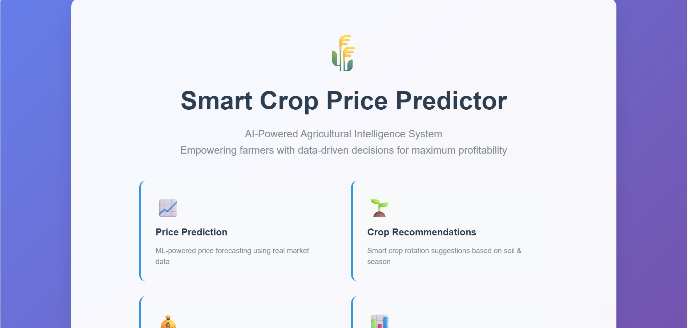
  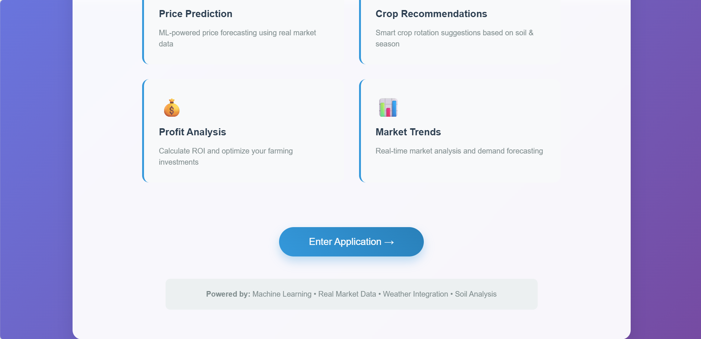
</p>


## 🔍 Price Prediction Page

This page allows users to select the **district, commodity, date, and market details** to generate an AI-powered crop price prediction.  
The system analyzes agricultural market data and instantly displays the **expected price per quintal** to support better farming and selling decisions.

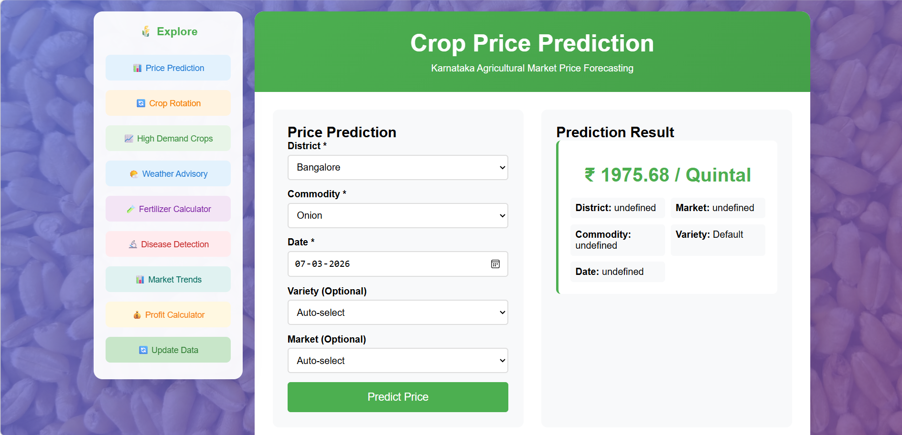


## 🌱 Crop Rotation Recommendation Page

This page analyzes factors such as **soil type, season, previous crop, and market district** to recommend the most profitable crop to cultivate.  
It provides insights including **expected profit, ROI, harvest time, and risk level** to help farmers make smarter planting decisions.

<p align="center">
  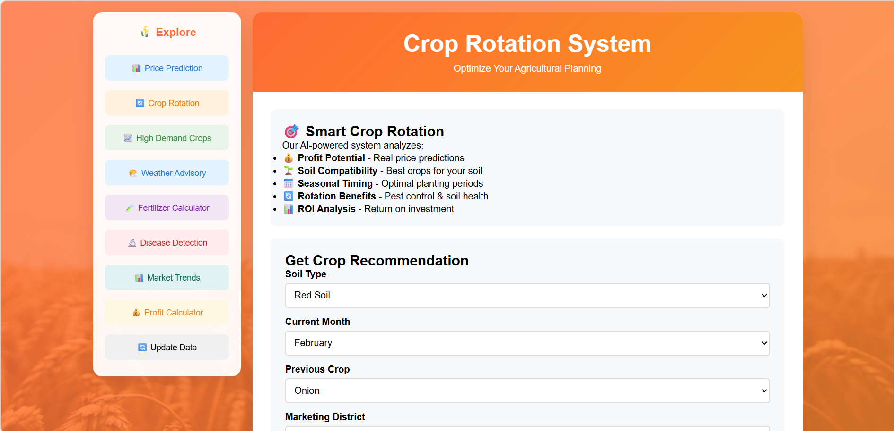
  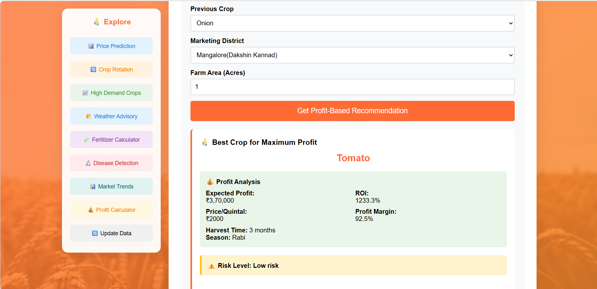
</p>


## 📈 High Demand Crops Page

<p align="center">
  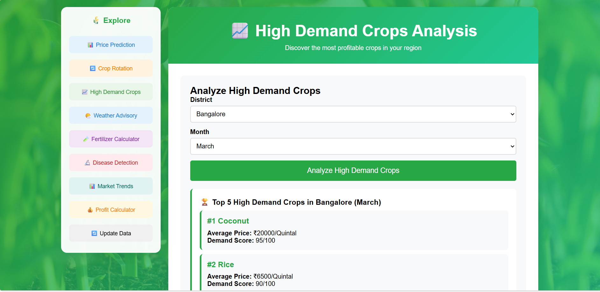
  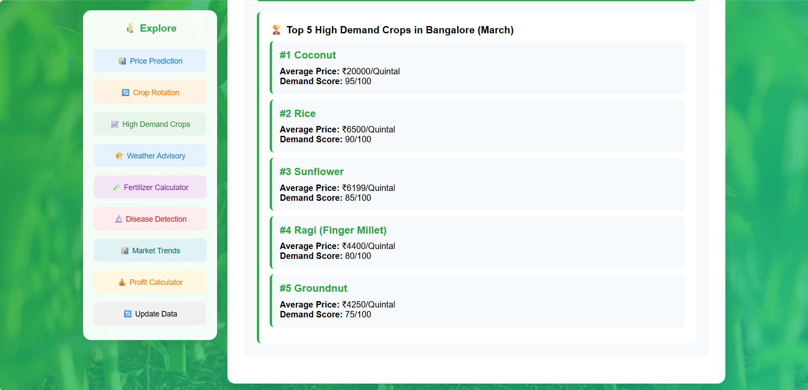
</p>


## ☁️ Weather Advisory Page

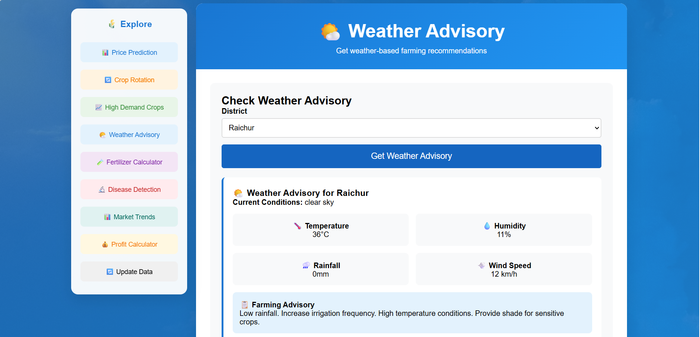

## 🧪 Fertilizer Calculator Page

<p align="center">
  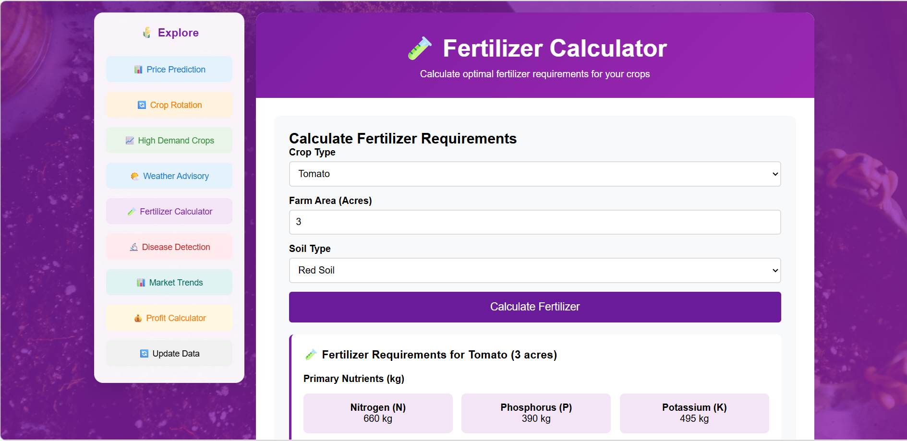
  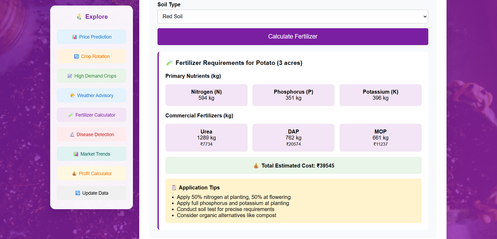
</p>

## 🦠 Disease Detection Page

<p align="center">
  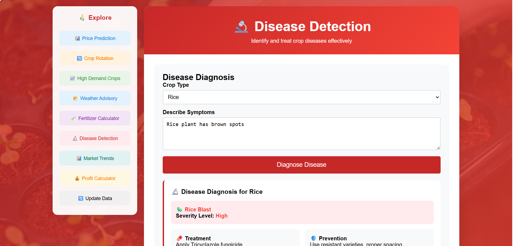
  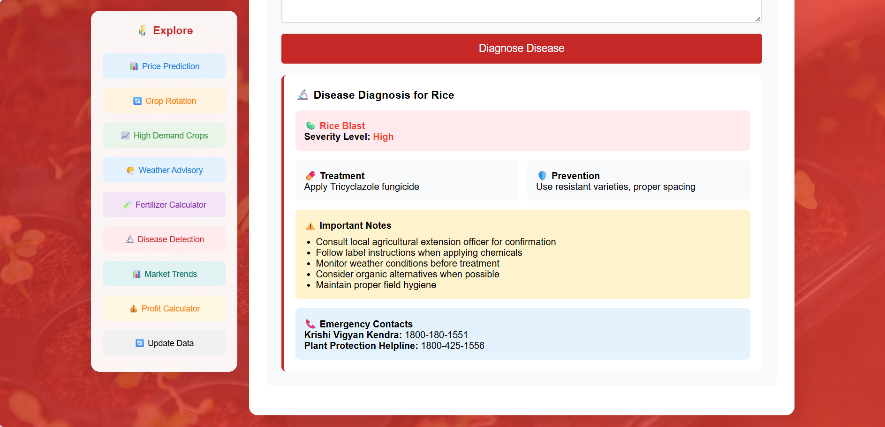
</p>

## 📊 Market Trends Page

<p align="center">
  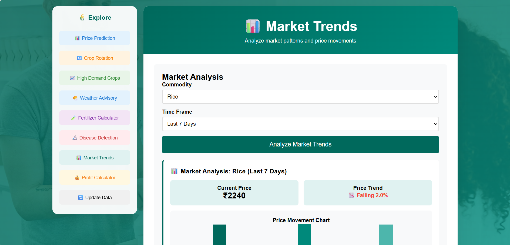
  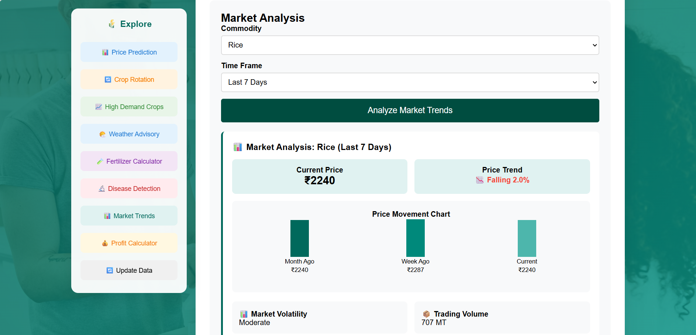
</p>

## 💰 Profit Calculator Page

<p align="center">
  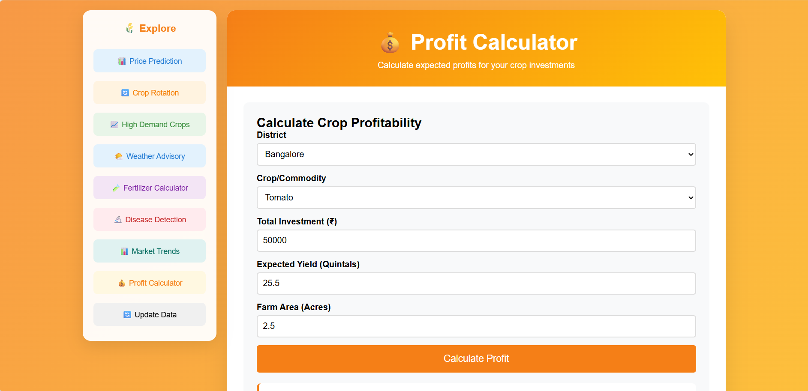
  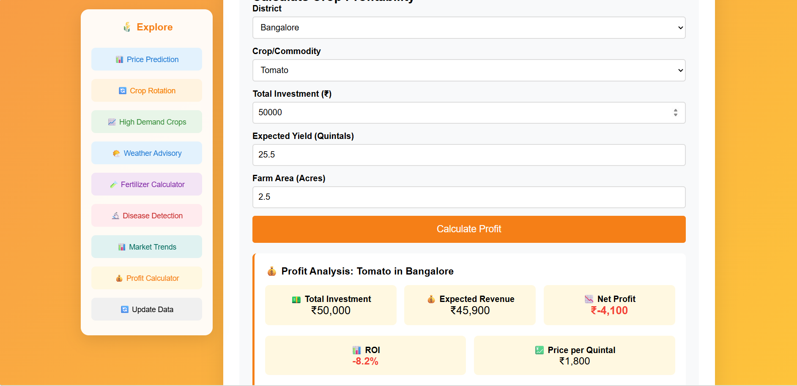
</p>

## 🔄 Update Data Page

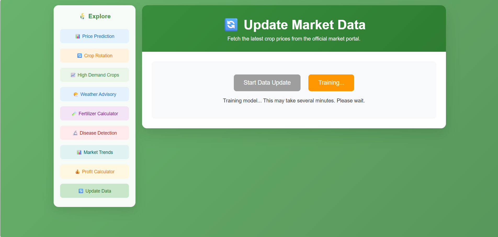
